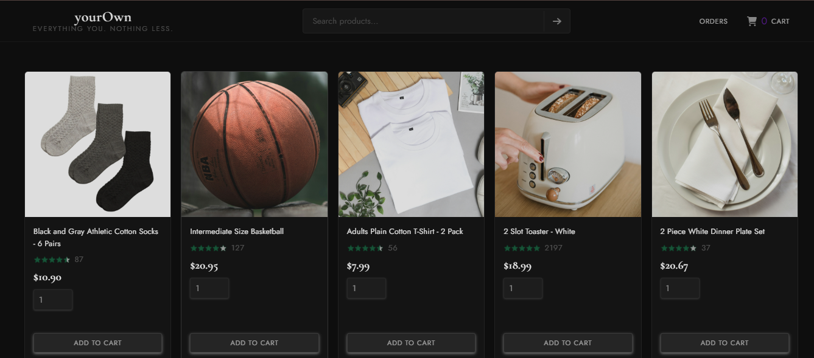
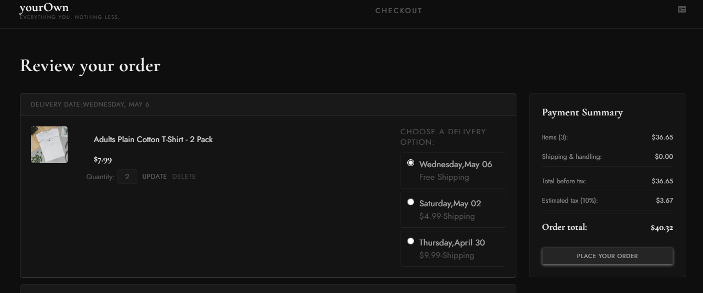
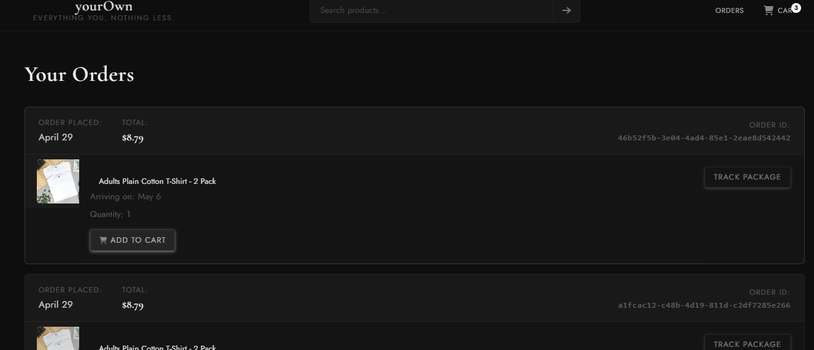

# 🛒 E-Commerce Store

A full-stack e-commerce web application built with **React** (Vite) on the frontend and **Node.js/Express** on the backend. Features product browsing, cart management, checkout flow, order tracking, and more.

---

## ✨ Features

- 🔍 **Product Search** — Search products in real time via query params
- 🛍️ **Product Grid** — Browse products with ratings, pricing, and quantity selection
- 🛒 **Cart System** — Add to cart with live quantity badge on header
- 💳 **Checkout Flow** — Cart summary, delivery options, and payment summary
- 📦 **Orders Page** — View past orders with buy-again support
- 🚚 **Order Tracking** — Track delivery status per order
- 🔔 **Toast Notifications** — Non-intrusive feedback on user actions
- 📱 **Fully Responsive** — Mobile-first design across all pages

---

## 🗂️ Project Structure

```
root/
├── frontend/     ← React + Vite
└── backend/      ← Node.js + Express
```

---

## 🖥️ Frontend

**Stack:** React, Vite, React Router, Axios, CSS

```
src/
├── components/        ← Header, Toast
├── pages/
│   ├── home/          ← Product listing & search
│   ├── checkout/      ← Cart, delivery, payment
│   ├── orders/        ← Order history
│   └── TrackingPage   ← Order tracking
└── utils/             ← Money formatting helpers
```

### Setup

```bash
cd frontend
npm install
npm run dev
```

Runs on `http://localhost:5173`

---

## ⚙️ Backend

**Stack:** Node.js, Express

Provides REST API endpoints consumed by the frontend.

| Method | Endpoint | Description |
|--------|----------|-------------|
| GET | `/api/products` | Get all products |
| GET | `/api/products?search=` | Search products by keyword |
| GET | `/api/cart` | Get cart items |
| POST | `/api/cart` | Add item to cart |
| PUT | `/api/cart/:id` | Update cart item quantity |
| DELETE | `/api/cart/:id` | Remove item from cart |
| GET | `/api/orders` | Get all orders |

### Setup

```bash
cd backend
npm install
npm start
```

Runs on `http://localhost:3000`

---

## 🚀 Getting Started

**1. Clone the repo**
```bash
git clone https://github.com/qasim-akram/yourOwn-Ecommerce-store.git
cd yourOwn-Ecommerce-store
```

**2. Start the backend**
```bash
cd backend
npm install
npm start
```

**3. Start the frontend**
```bash
cd frontend
npm install
npm run dev
```

**4. Open in browser**
```
http://localhost:5173
```

---

## 🧪 Running Tests

```bash
cd frontend
npm run test
```

Tests are written with **Vitest** and cover:
- `HomePage` rendering
- `Product` component
- `money.js` utility formatting

---

## 🌍 Environment Variables

Create a `.env` file in the **backend** folder:

```env
PORT=3000
MONGO_URI=http://localhost:3000
```

Create a `.env` file in the **frontend** folder:

```env
VITE_API_URL=http://localhost:3000
```

> ⚠️ Never commit `.env` files — they are already in `.gitignore`

---

## 📸 Screenshots





---

## 📄 License

MIT — free to use and modify.
