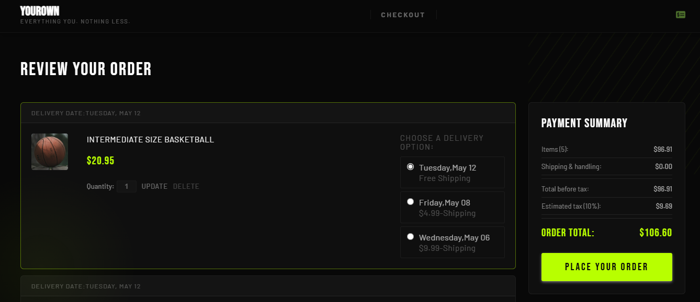
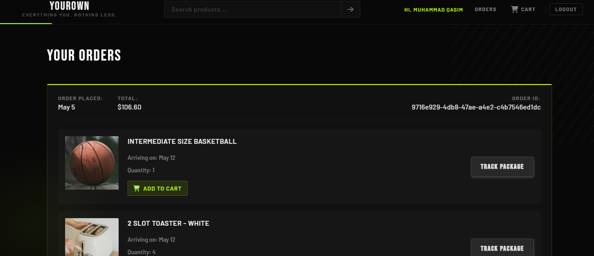

# yourOwn Store 🛒

> **Everything You. Nothing Less.**  
> A full-stack e-commerce web application built with React, Node.js, Express, and SQLite.

🌐 **Live Demo:** [https://qasim-ecommerce.azurewebsites.net](https://qasim-ecommerce.azurewebsites.net)

---

## 📸 Screenshots

| Home | Checkout | Orders |
|------|----------|--------|
|  |  |  |

---

## ✨ Features

- 🔐 **JWT Authentication** — Signup, login, and protected routes
- 🛍️ **Product Browsing** — Search and filter 40+ products
- 🛒 **Cart Management** — Add, update quantity, delete items
- 🚚 **Delivery Options** — Choose from 3 delivery speeds per item
- 💳 **Payment Summary** — Live cost breakdown with 10% tax
- 📦 **Order Tracking** — Visual progress bar (Preparing → Shipped → Delivered)
- 🔄 **Buy Again** — Re-add past order items to cart instantly
- 🧪 **Unit Tests** — Vitest + React Testing Library coverage

---

## 🚀 Deployment

The app is deployed as a single Azure App Service instance (UAE North region).

| Layer | Service |
|-------|---------|
| Frontend | Served as static files from `/dist` by Express |
| Backend | Azure App Service (B1) — Node.js 22 LTS |
| CI/CD | GitHub Actions — auto-deploys on push to `main` |

🔗 **Live URL:** [https://qasim-ecommerce.azurewebsites.net](https://qasim-ecommerce.azurewebsites.net)

---

## 🗂️ Project Structure

```
yourOwn-store/
├── backend/                  # Node.js + Express API
│   ├── models/               # Sequelize models (User, Product, CartItem, Order)
│   ├── routes/               # REST API routes
│   ├── middleware/           # JWT auth middleware
│   ├── defaultData/          # Seed data
│   └── server.js             # Entry point
│
└── frontend/                 # React + Vite SPA
    └── src/
        ├── components/       # Header, Toast, ProtectedRoute
        ├── context/          # Auth context (JWT state)
        ├── pages/
        │   ├── home/         # Product grid + search
        │   ├── checkout/     # Cart, delivery options, payment
        │   ├── orders/       # Order history + buy again
        │   ├── account/      # Login & Signup
        │   └── TrackingPage  # Package tracking
        └── utils/            # Money formatter
```

---

## 🛠️ Tech Stack

### Frontend
| Tech | Purpose |
|------|---------|
| React 19 | UI framework |
| React Router v7 | Client-side routing |
| Axios | HTTP requests |
| Day.js | Date formatting |
| Vite | Build tool |
| Vitest + Testing Library | Unit testing |

### Backend
| Tech | Purpose |
|------|---------|
| Node.js + Express | REST API server |
| Sequelize ORM | Database abstraction |
| SQLite (sql.js) | Embedded database |
| JWT (jsonwebtoken) | Authentication tokens |
| bcryptjs | Password hashing |
| nodemon | Dev auto-restart |

---

## 🚀 Getting Started

### Prerequisites
- Node.js **v22** (required — v24 has a known crash with sql.js-as-sqlite3)
- npm

### 1. Clone the repo

```bash
git clone https://github.com/Qasim-Akram/yourOwn-store.git
cd yourOwn-store
```

### 2. Start the Backend

```bash
cd backend
npm install
npm run dev
```

Backend runs at `http://localhost:3000`

### 3. Start the Frontend

Open a new terminal:

```bash
cd frontend
npm install
npm run dev
```

Frontend runs at `http://localhost:5173`

> The frontend proxies all `/api` requests to the backend automatically via Vite config.

---

## 🔌 API Reference

| Method | Endpoint | Description | Auth |
|--------|----------|-------------|------|
| POST | `/api/auth/signup` | Register new user | ❌ |
| POST | `/api/auth/login` | Login, returns JWT | ❌ |
| GET | `/api/auth/me` | Get current user | ✅ |
| GET | `/api/products` | List all products | ✅ |
| GET | `/api/products?search=...` | Search products | ✅ |
| GET | `/api/cart-items` | Get cart | ✅ |
| POST | `/api/cart-items` | Add to cart | ✅ |
| PUT | `/api/cart-items/:productId` | Update quantity/delivery | ✅ |
| DELETE | `/api/cart-items/:productId` | Remove from cart | ✅ |
| GET | `/api/orders` | Get all orders | ✅ |
| POST | `/api/orders` | Place order (clears cart) | ✅ |
| GET | `/api/orders/:orderId` | Get single order | ✅ |
| GET | `/api/payment-summary` | Cart cost breakdown | ✅ |
| POST | `/api/reset` | Reset DB to defaults | ✅ |

---

## 🧪 Running Tests

```bash
cd frontend
npm run test
```

Tests cover:
- `formatMoney()` utility function
- `Product` component rendering and add-to-cart behavior
- `HomePage` product grid rendering

---

## ⚠️ Known Issues & Notes

- **Node.js v24 incompatibility** — The `sql.js-as-sqlite3` package crashes on Node v24 due to a libuv async handle issue. Use **Node v22 LTS**.
- The SQLite database persists to `backend/database.sqlite`. Hit `POST /api/reset` to restore default data.
- JWT tokens expire after **7 days**.

---

## 👤 Author

**Muhammad Qasim**  
🎓 BSCS Student — Islamia University of Bahawalpur  
🔗 [github.com/Qasim-Akram](https://github.com/Qasim-Akram)  
💼 [linkedin.com/in/qasimakram](https://linkedin.com/in/qasimakram)  
🌐 [mqasimakram.netlify.app](https://muhammadqasimakram.netlify.app)

---

## 📄 License

This project is open source and available under the [MIT License](LICENSE).
